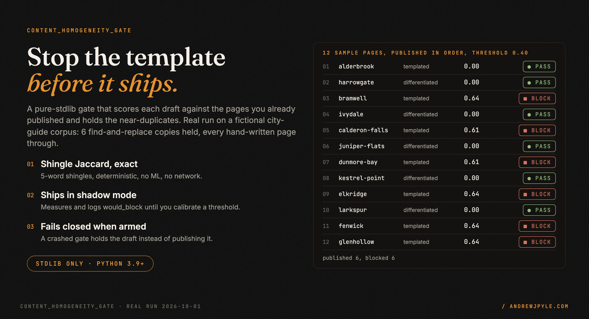
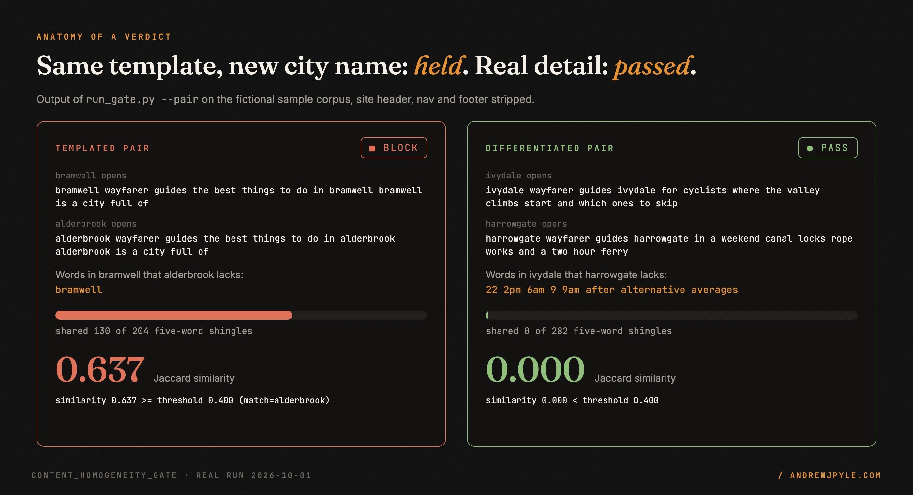
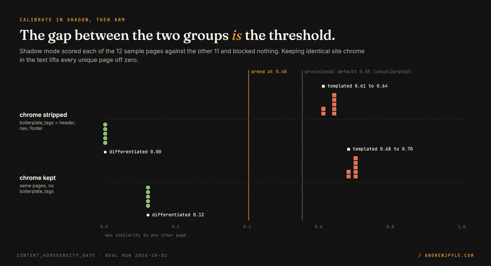
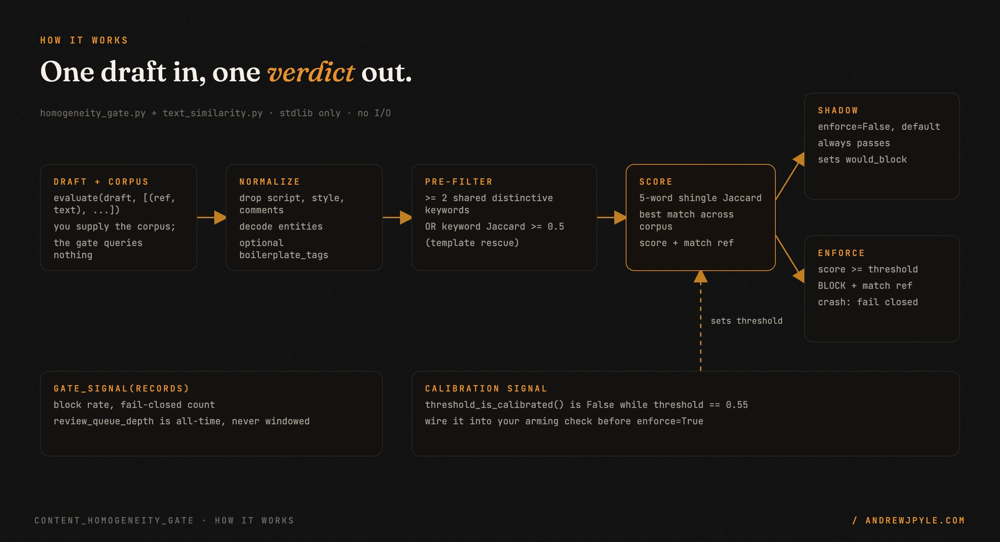

<p align="center">
  
</p>

<p align="center">
  <a href="https://github.com/andrewjpyle/content_homogeneity_gate/actions/workflows/ci.yml"></a>
  
  
  
</p>

# A pre-publish gate for templated, near-duplicate pages

When you generate pages at scale (500 city guides, 10,000 game recaps), the risky output is the
page that reads like your other pages because the same template filled it. This gate scores each
draft against **the pages you already published** and holds the ones that are too similar, before
they go live. It is two stdlib Python modules: deterministic word-shingle Jaccard behind a keyword
pre-filter. No ML, no network, no database.

- **You supply the corpus.** `evaluate(draft, [(ref, text), ...])`. The gate never queries anything,
  so it fits a Django signal, a Celery task, a CLI or a plain script the same way.
- **It ships inert.** Shadow mode (the default) measures and flags `would_block` but never holds a
  page, until you calibrate a threshold from your own score distribution.
- **Armed, it fails closed.** With `enforce=True` a block holds the draft, and a crashed gate holds
  it too instead of letting it auto-publish.

> **The one idea worth stealing, even if you never run this code:** a quality gate should ship
> unable to block anything. "Reject anything over 0.55 similarity" is a number someone made up, and
> enforcing it silently drops good pages or caps throughput. "Log what 0.55 *would* have blocked for
> a week, look at the gap between the groups, then arm it at the number the data shows" is a gate you
> can trust. Expose an `is_calibrated()` signal and make your arming step refuse without it.

---

## 60 seconds to a real verdict

```bash
git clone https://github.com/andrewjpyle/content_homogeneity_gate.git
cd content_homogeneity_gate
python3 examples/city_guides/run_gate.py --enforce --threshold 0.40
```

No install step: Python 3.9+ and nothing else. The [sample corpus](examples/city_guides/pages) is
**fictional**: twelve city-guide pages for made-up towns. Seven are one template with only the city
name swapped; five are written page by page. Every page is a full HTML document with the same site
header, nav, footer and analytics snippet. The runner publishes them in a mixed order, comparing each
draft with what is already live. Real output
([capture](docs/assets/src/captures/enforce.json)), reason column trimmed:

```
ENFORCE: publish in order, threshold 0.40 (calibrated: True)
#     page            kind            verdict     score compared  reason
1     alderbrook      templated       PASS         0.00        0  -
2     harrowgate      differentiated  PASS         0.00        1  -
3     bramwell        templated       BLOCK        0.64        2  similarity 0.637 >= threshold 0.400 (match=alderbrook)
4     ivydale         differentiated  PASS         0.00        2  -
5     calderon-falls  templated       BLOCK        0.61        3  similarity 0.610 >= threshold 0.400 (match=alderbrook)
...
11    fenwick         templated       BLOCK        0.64        6  similarity 0.637 >= threshold 0.400 (match=alderbrook)
12    glenhollow      templated       BLOCK        0.64        6  similarity 0.637 >= threshold 0.400 (match=alderbrook)
published 6, blocked 6
```

The first templated page passes because nothing is live for it to match. Every later copy is held
and points at the page it duplicates. To see why one pair scored what it did:

```bash
python3 examples/city_guides/run_gate.py --pair bramwell alderbrook --threshold 0.40
```

<p align="center"></p>

The only word in `bramwell` that `alderbrook` lacks is `bramwell`. That page still scores 0.637,
not 1.0, because every swapped name breaks the five-word shingles around it. That is why the
threshold has to come from your own data.

## Calibrate, then arm

Run the gate in shadow mode first. Without `--enforce` the runner scores every page against the
other eleven and blocks nothing ([capture](docs/assets/src/captures/shadow.json)):

```
templated       max-similarity range 0.61 to 0.64
differentiated  max-similarity range 0.00 to 0.00
```

<p align="center"></p>

On this corpus any threshold between the two groups separates them; 0.40 sits in the gap. With the
site header, nav and footer left in the text, the same unique pages score 0.12 instead of 0.00
([capture](docs/assets/src/captures/shadow_keep_chrome.json)). Shared chrome shrinks the gap, which is
why `boilerplate_tags` exists. In production, wire the calibration signal into your arming step:

```python
from homogeneity_gate import HomogeneityGate

gate = HomogeneityGate(
    threshold=0.40,                       # picked from YOUR shadow-mode distribution
    enforce=True,
    boilerplate_tags=("header", "nav", "footer"),
)
if not gate.threshold_is_calibrated():    # False while threshold == 0.55, the provisional default
    raise RuntimeError("refusing to enforce an uncalibrated homogeneity threshold")

corpus = [(p.slug, p.body) for p in already_published_pages]
result = gate.evaluate(draft_html, corpus)
if not result.passed:
    hold_for_review(draft, reason=result.reason, near_duplicate=result.match_ref)
```

| Option | Default | What it does |
|---|---|---|
| `threshold` | `0.55` (provisional) | Block at or above this score. `threshold_is_calibrated()` is False until you move it. |
| `enforce` | `False` | Shadow mode: always passes, sets `would_block`. `True`: blocks and fails closed. |
| `boilerplate_tags` | `()` | Elements removed before scoring, e.g. `("header", "nav", "footer")`. |
| `shingle_k` | `5` | Words per shingle. |
| `prefilter_stopwords` | empty | Your domain's ubiquitous vocabulary, so the pre-filter keys on distinctive words. |
| `prefilter_min_overlap` | `2` | Distinctive keywords a corpus page must share to be scored. `0` scores everything. |
| `prefilter_rescue_ratio` | `0.5` | Template rescue: also score pages whose keyword sets overlap this much. `None` disables. |

`<script>`, `<style>`, `<noscript>`, `<template>` and HTML comments are always dropped, and entities
are decoded, so an analytics snippet or `&amp;` never becomes shingles.

### Django wiring

The gate has no Django dependency. Scope the corpus to what competes for indexing:

```python
from django.conf import settings
from homogeneity_gate import HomogeneityGate

def build_gate():
    return HomogeneityGate(
        threshold=settings.HOMOGENEITY_THRESHOLD,
        enforce=settings.HOMOGENEITY_ENFORCE,
        boilerplate_tags=("header", "nav", "footer"),
    )

def check_before_publish(page):
    corpus = [
        (p.slug, p.body)
        for p in Page.objects.filter(site=page.site, kind=page.kind)
                             .exclude(pk=page.pk)
                             .order_by("-created_at")[:200]
    ]
    return build_gate().evaluate(page.body, corpus)
```

A queryset, a list or a generator all work; the gate reads the corpus once.

## How it works

<p align="center"></p>

1. **Normalize.** Lowercase, drop invisible markup and any `boilerplate_tags`, strip tags and
   punctuation.
2. **Pre-filter.** A corpus page is scored only if it shares at least `prefilter_min_overlap`
   distinctive keywords with the draft, or its keyword set overlaps the draft's by at least
   `prefilter_rescue_ratio`. This still reads every page; it skips the shingle comparison for pages
   that cannot be near-duplicates.
3. **Score.** Jaccard of the two sets of five-word shingles. Identical text is 1.0, no shared
   five-word run is 0.0. The best match across the corpus wins.
4. **Decide.** Shadow mode returns the score and `would_block`. Enforce mode blocks at or above the
   threshold with `match_ref`, and any internal error returns `failed_closed=True` instead of raising.

`gate_signal(records)` rolls stored outcomes into block rate, fail-closed count and
`review_queue_depth`. Queue depth is deliberately all-time: a held draft stays a problem until a
person clears it, so a windowed count would report zero the day after a block.

## Scope: what it does not do

- **It does not check the open web.** It compares against your own pages only. Copying from other
  sites is a job for a plagiarism service.
- **It does not judge quality.** A thin page that is unique passes. An empty draft passes. Pair it
  with a content-quality check.
- **Very short pages are barely scored.** A text under five words becomes a single shingle, so two
  near-identical short strings score 0.0 unless they are exactly equal.
- **It is not semantic.** A page rewritten with new wording but the same facts and structure scores
  low. Shingles catch reused text, not reused ideas.
- **It does not scale past an exact scan.** Each call tokenizes every corpus page. For large corpora
  the next step is MinHash + LSH (for example [`datasketch`](https://github.com/ekzhu/datasketch));
  this package stays stdlib and exact on purpose.
- **It does not fix the first copy.** The first page of a template has nothing to match and passes.

## The patterns

| Pattern | The failure it prevents |
|---|---|
| Ship in shadow mode | an invented threshold silently dropping good pages on day one |
| `threshold_is_calibrated()` as an arming precondition | someone flipping `enforce=True` before the number means anything |
| Fail closed only when armed | a crashed gate auto-publishing, or a crashed monitor dropping content |
| Caller supplies the corpus | a library that reaches into your database or picks the wrong scope |
| Template rescue in the pre-filter | a stop word list stripping the template's own words and blinding the filter to copies |
| Strip invisible markup and shared chrome | identical scripts, nav and footers making unique pages look alike |
| All-time review queue depth | a held draft disappearing from the dashboard the day after it was held |

## FAQ

**Why not just compare against everything?** You can: `prefilter_min_overlap=0`. The pre-filter is
an optimization. It skips the shingle step for pages that share almost no distinctive vocabulary.

**How should I build `prefilter_stopwords`?** From a written list of words every page in your domain
uses, including pages that are genuinely different (see
[`examples/sports_stopwords.py`](examples/sports_stopwords.py)). Do not build it by counting the most
frequent words in your own output: in a templated corpus those words *are* the template. Before this
release that recipe made the gate pass find-and-replace pages at 0.0; the template rescue now catches
it, and a test pins the case.

**What threshold should I use?** Whatever sits in the gap in your shadow-mode data. On the sample
corpus that gap runs from 0.00 to 0.61. Your template density and page length move both groups.

**Does it need Django?** No. Django is one example caller.

## Development

```bash
python3 -m unittest discover -s tests -v   # 39 tests, stdlib unittest
```

CI runs the suite on Python 3.9 to 3.13, fails if fewer than 39 tests ran, and runs both quickstart
modes against the sample corpus. The README graphics are rebuilt from the committed captures with
`docs/assets/src/build.py`.

## Roadmap

- An optional MinHash + LSH backend for corpora where the exact scan gets slow.
- A calibration helper that suggests a threshold from shadow-mode scores.

## License

MIT. By [Andrew Pyle](https://andrewjpyle.com). One of the reusable parts listed at
[autonomousaj.com/parts](https://autonomousaj.com/parts).
